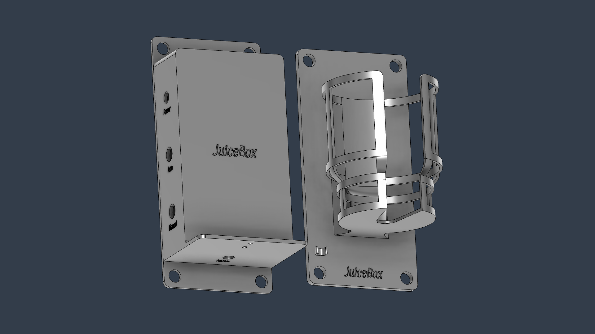

# :beverage_box: JuiceBox: a liquid reward delivery system

JuiceBox is a liquid reward delivery system designed specifically for animal research. The JuiceBox system consists of:

1. A control box, which:
    - controls a solenoid valve via computer (auto) and manual inputs,
    - has a timed-draining function which opens the valve for a set duration, and
    - features mounting holes for the valve and a tube holder.
2. A bottle holder, which:
    - holds the juice bottle securely in place,
    - enables easy bottle removal, and
    - features a tube holder to keep your hands free.



---
## Table of Contents
- [Building & setting up your own JuiceBox](#building--setting-up-your-own-juicebox)
- [Using JuiceBox](#using-juicebox)
- [Circuit diagram](#circuit-diagram)
- [Latency test](#latency-test)
- [Contact](#contact)
---

## Building & setting up your own JuiceBox

### 0. Gather tools and supplies

The table below lists all the tools and supplies you’ll need to build a JuiceBox from scratch. If you already have a functioning control box, you’ll only need a 24V DC power cable, things listed in “Juice Bottle & Holder” and “Mounting,” and any relevant tools.

|  | **Name** | **Qty** | **Purpose & Specifications** |
| --- | --- | --- | --- |
| **Circuit Board** | PCB board | 1 | Custom files provided in this repository. See ordering instructions below. |
|  | 7805 voltage regulator | 1 | Can be pre-assembled on the PCB board (see PCB ordering instruction below). [Example product](https://www.amazon.com/ALLECIN-L7805-Regulator-Positive-Regulators/dp/B0CBKCDT4H/ref=sr_1_4?crid=2WCJKAQUHKRN7&dib=eyJ2IjoiMSJ9.yJzEi34CZ1WRm1_J6qxU1pyW9wghQLtg6IbF4fboZbTi889ok1h4hG9QhPJFAEpCzUIHdzyGpYp6OKTvsvIaCrYhlPovNcXIZuAi9Dkfmnm6QhzktdkW-ZoMuQcdPGAh4T31KEgbjpQAathV_9ffThyl1RSwhNaUL8IgItWbd8ZooAMghe03Zn5gxsPbM6_Zx74NqrIcUzpZuqI0Oic3-y2wBG06QpNkweJO2UbEySM.Bm0LgsJNeZJxWlu8izlvLKQT0AeiNju88KjW7ySMW00&dib_tag=se&keywords=7805%2BVoltage%2BRegulator&qid=1731457314&sprefix=tip122%2Bbipolar%2B%2Bbjt%2B%2Btransistor%2Bnpn%2B-%2Bdarlington%2B100v%2B5a%2B2w%2Bthrough%2Bhole%2Bto-220%2Caps%2C106&sr=8-4&th=1) |
|  | TIP122 bipolar transistor NPN | 1 | Can be pre-assembled on the PCB board (see PCB ordering instruction below). [Example product](https://www.amazon.com/ALLECIN-TIP122-Darlington-Transistor-Transistors/dp/B0CBKHTF9Z/ref=sr_1_3?crid=NHRWZAHM1KV9&dib=eyJ2IjoiMSJ9.h3c-xIy3MyTNjNTX3uCVtWWhdCAKbOBndhBnrGHPSWJUYxQc2KRioEiGCYQBQcaRg4totEood89ma_FmvDkk3stY6_0givGyjF8UUVD97Pjm6ek0hKZ99DP62D-fp6lwyGHInEgTdVrOV93C7CnteNRl2_INSGFWc2m_ZW1P5-Mf1aypLYuwvF-b5je-ar5emGewDr7abdsp8Gmo1LIBanKPAjnUqUAsEpXOZKP4wJY.HsZmLjGl8ASvvx4FFpKWcOrIbTktyNr3QxbMoi2U8qs&dib_tag=se&keywords=TIP122%2BBipolar%2B(BJT)%2BTransistor%2BNPN%2B-%2BDarlington%2B100V%2B5A%2B2W%2BThrough%2BHole%2BTO-220&qid=1731457071&sprefix=tip122%2Bbipolar%2Bbjt%2Btransistor%2Bnpn%2B-%2Bdarlington%2B100v%2B5a%2B2w%2Bthrough%2Bhole%2Bto-220%2Caps%2C143&sr=8-3&th=1) |
|  | 1N4007 diode | 1 | Can be pre-assembled on the PCB board (see PCB ordering instruction below). [Example product](https://www.amazon.com/Gratux-1N4007-Junction-Standard-Rectifier/dp/B094ZL2D1D/ref=sr_1_4?crid=29Z6BU8XTI3JY&dib=eyJ2IjoiMSJ9.WTasZ6bLzkfYGOf6drxvnZU7VKBncva7np3YBChdvqWEyGsSoZxENb71OisgmP76NQ6-iQRkSsRHx1cV--fE_tIpnlRFOTjXD_QRiwxDvn6MgZBxy8WwaKEAgNIzW0JRIEcasM6-UWq7BOQEt5mdzwl5qla0ZNYpBozhZPNFt3JJGcCcfrYQu3qfFrHECAcZtwPQHVAonbcnxsZtaFPbfQRD0-Xv3EkaQutWgrXfOYA.Lck7D6KoyzXsiKviougeUGX83vtRvIIcHRxwnV-D8js&dib_tag=se&keywords=Diode+1N4007&qid=1731457386&sprefix=diode+1n4007%2Caps%2C363&sr=8-4) |
|  | 10kΩ resistor | 1 | Can be pre-assembled on the PCB board (see PCB ordering instruction below). [Example product](https://www.amazon.com/EDGELEC-Resistor-Tolerance-Multiple-Resistance/dp/B07QJB31M7/ref=sr_1_4?crid=3W0PGIGRATIF3&dib=eyJ2IjoiMSJ9.6LwS_eL7GUDzrQTHCbHoUrXbUU6GcLf0Oh8KSANGZZdL6R_ioPvyKDDQzauwyocWAuH3uBKmSpWpA_eLq0MN4xKo8bmwQI0SGAySut8kUdZWewfVtrmSt_84dPwnOGJruGBS2MqxdSw4U9RSSM5YlSGHeTFUmjxPcRQ4s1W2re7aTogJlQVbuV81ZufTKkF5W34owsloKbJ7khKqYiVpWbWT21vB-TlA58s44IKvpGs.H3vq5bNiRlspgB_dFPIU1vL0NQbb9xow7vAFLmVgaQk&dib_tag=se&keywords=10k%2Bohm%2Bresistor&qid=1731457561&sprefix=10k%2Bohm%2Bresistor%2Caps%2C132&sr=8-4&th=1) |
|  | 1kΩ resistor | 1 | Can be pre-assembled on the PCB board (see PCB ordering instruction below). [Example product](https://www.amazon.com/EDGELEC-Resistor-Tolerance-Multiple-Resistance/dp/B07QG1V4YL/ref=sr_1_4?crid=9NGTKX7GOGT5&dib=eyJ2IjoiMSJ9.sjCrXtEr0PMGKZXQLPwE43Cm6Wuj_WtcdUxQqil3rZKYmxsW4Hdgn-4ivHmgXhPIXi8GvcwZnD0TmNpFv3DZBSPKdfVEAqTo1g4hwDk6zHdOYBZBGA2zZd_AWqRBViXud4u0CQg8fOSFjpMFEOFSoZWOGK9OgKwov7B3yMGC6-D05ZK2Zr9Qa5IDsuLBAQbISwKExnlai8jGw5q-4knqfeUevEgE2gigcbWQJIJjhKA.NTQfoTQ23CI5UKpTUx2ALHZFxTXFkuewyLlWkqgpxLI&dib_tag=se&keywords=1k%2Bohm%2Bresistor&qid=1731457618&sprefix=1k%2Bohm%2Bresistor%2Caps%2C80&sr=8-4&th=1) |
|  | Timer relay module | 1 | For timed-draining. Should allow at least ~3 minutes of circuit activation. [Example product](https://www.amazon.com/Coliao-Relay-Programmable-Delay-Trigger/dp/B0C6PRP3SD) |
| **Control Box** | JuiceBox control box (2 parts) | 1 | Custom STL files provided in this repository. See printing instructions below. |
|  | DC power female jack | 2 | For connecting the power cable and the solenoid valve. Mounting hole size: 8mm. [Example product](https://www.amazon.com/Antrader-24pcs-Female-Socket-Connector/dp/B07CTCLKPP/ref=sr_1_7?crid=27E3ZA791MXGN&dib=eyJ2IjoiMSJ9.G0qsGqVtqUh_MzpxbfzFVR_ahLdPyr4hm5xM-HFQozcQ5FGNJ7Iyi5FGI7u5KXu5W25WerjXk0ZjkQ8R0gSKAx1BV9jjVTAYTzSGYGEux7TBotKe2JQzrNXtaOEtW2cOmYkwMoPraN8CAxFcpwvbK-3pJwrMqFeP2NRD6toxj3u8EaMovjeXwCsVGCpApjfzVGqZDhnmzhvnn3IPJoBPNvLd1aDCAD4Vz_Uqx7f93CkfIkFt3QiTttKnCcPzlMG0IDJO-pBR2kG0uLUeVv6Mg0gIZyGM6ZeaqnZ8DYtWlvw.2gLL3oBBm8bbSFGmCYeUkpFK7pTFvhp3nbEr3FNgCYs&dib_tag=se&keywords=24V+DC+Power+Jack+Female&qid=1731459468&s=industrial&sprefix=24v+dc+power+jack+female%2Cindustrial%2C69&sr=1-7) |
|  | BNC female connector | 2 | For connecting auto and manual inputs. Mounting hole size: 10mm. [Example product](https://www.amazon.com/Hxchen-Female-Bulkhead-Insulated-Connector/dp/B07V1SWM9J/ref=sr_1_1?crid=2NG5997LXJS1G&dib=eyJ2IjoiMSJ9.DqvluEvvbyZoupcrHrtUDo3ia0fTd9TcnjKIpQs7Jn63A2n4Am_if-ZBLvsjAhCQYrIagbD-fAVcue69FS0aDIaCi_EUqk4EHWzI5Yt2JZVUx9ZoQf6Uv7P-RLAy-GClVXxCdszSs-HQpH8CSDyM4YRiuxBnrUIK3dx7wMRbkmSmlHqoBtnVcueZfO16186F1lBa_nBr8OiG9a2JRSZlZl5nIpSlt9D3z_ZcymH-dHvhaMIySPkN9TEmdUmSGH3hid4kgAeg6MbhqojkSE-hGjbZxnLG2N6wINCAV6vGpAk.bJCI6rmy8P2Kts4S21CpPxp6Qc3F2SUEnrVzPqtmF4Q&dib_tag=se&keywords=BNC+Female+Jack+Bulkhead+Solder+Panel+Mount+Insulated+Coax+Rf+Connector&qid=1731458227&s=electronics&sprefix=bnc+female+jack+bulkhead+solder+panel+mount+insulated+coax+rf+connector%2Celectronics%2C259&sr=1-1) |
|  | Momentary push button with LED light | 1 | For timed-draining and drain signal light. Mounting hole size: 12mm. [Example product](https://www.amazon.com/dp/B0C38V5TY5?ref=fed_asin_title&th=1) |
|  | DC power male plug | 1 | To be soldered onto the solenoid valve. [Example product](https://www.amazon.com/Fancasee-Replacement-Solder-Connector-Adapter/dp/B07Y8M8TWM/ref=sr_1_1_sspa?crid=2RDTN4C3PBLUR&dib=eyJ2IjoiMSJ9.PJr6EG-Jalyz612j4p3UJfSf8D1HD5KMjlq1QGLVs5FQDX76ZjZ8GPVaFXS35Tge_L_9MvSrKagtzCC2VnKADLzaXi6-iyjtz7NY_M1UUe9jsjRuFaDTv1GRJWAFiIxVILuUI4c0PDGBltAWYaeeVZOeiL_uGoXBioNkdi3eBtMDhciiCP9jnhKzUzC90jtno93tNryqJipnfFiftSEhO33Ajm5h9ZZf6-KV40YusYY.TjM1M5agFEvbo74nm8Ixgfc3lenq8qVDp9dKAW9R8qM&dib_tag=se&keywords=male+power+jack+solder&qid=1731463868&sprefix=male+power+jack+solde%2Caps%2C153&sr=8-1-spons&sp_csd=d2lkZ2V0TmFtZT1zcF9hdGY&psc=1#customerReviews) |
|  | Solenoid valve | 1 | For dispensing liquid reward. [003-0257-900 Parker Hannifin](https://ph.parker.com/us/en/product/series-3-miniature-inert-liquid-valve/003-0257-900) |
|  | 4-40 screws | 14 | For mounting the PCB boards and closing the lid of the control box. 4-40, 0.25 inch long, Coarse (UNC). [Example product](https://www.mcmaster.com/90272A106/) |
|  | 24V DC power cable | 1 | Power input to the control box. [Example product](https://www.amazon.com/TKDY-110-240V-Soundbar-Diffuser-Humidifier/dp/B08F7DVY8G/ref=sr_1_1?crid=2XTC3WP66E4PS&dib=eyJ2IjoiMSJ9.1rwGyqucQMA0ikWW6m25nZlqNzJLzthmtLffw5Vmouw-WYvEX63Ih_JTnVeNnlVLTlo2rXA_iYsOXJBz0A9que0eISOFq83kk_4gZlfP7D4poAV-EiKVw8wKZBsFUrAL0xUFKfikXNYo0vFUbfz5J1l1bPNbfd9-bpqSDgJZKzuQbTj1Gq9k-nuf7STRpD2-Ve6v7EZgpyID-JCGcoVAhlfz7tqeRj5X5zDHWoiEo7g.mf3D35VGWo5KkCPKBrZ9MfFbitbzkuL6UN6FctduNGQ&dib_tag=se&keywords=24V+DC+power+cable&qid=1739488720&sprefix=24v+dc+power+cable%2Caps%2C95&sr=8-1) |
| **Juice Bottle & Holder** | JuiceBox bottle holder | 1 | Custom STL file provided in this repository. See printing instructions below. |
|  | Wash/squeeze bottle | 1 | For holding liquid reward. Roughly 500mL, 73mm diameter, 53mm closure. [Example product](https://www.amazon.com/gp/product/B000N478A8/ref=ppx_yo_dt_b_search_asin_title?ie=UTF8&psc=1) |
|  | Plastic tubing |  | For delivering liquid reward. Inner diameter: 1/8 inch, outer diameter: 1/4 inch. [Example product](https://www.mcmaster.com/5233K52/) |
| **Mounting** | Mounting screws (optional) | 8 | For mounting the control box and the bottle holder. The mounting holes on the control box and bottle holder are 9mm in diameter. |
|  | Mounting nuts (optional) | 8 | For mounting the control box and the bottle holder. Size: same as the mounting screws. |
|  | Velcro strips (optional) |  | For mounting the control box and the bottle holder |
| **Tools** | Soldering tools (soldering gun, solder, wires, wire stripper, etc.) |  | For making the control box circuit. |
|  | 4-40 taps | 2 | For tapping the holes on the control box. 1x taper tap + 1x bottoming tap. [Example product](https://www.amazon.com/MaxTool-THREAD-3-Piece-Bottom-HSN02W00R04/dp/B07J1MJJ6X?th=1) |
|  | Phillips-head screwdriver(s) | 1-2 | For screwing 4-40 and mounting screws. |
|  | Scissors/blade/saw |  | For cutting the squeeze bottle and tubing. |

> [!NOTE]
> **Instructions for ordering the PCB board:**
> - You can order the PCB board from [JLCPCB](https://jlcpcb.com/) (cheap and fast, highly recommend) or similar vendors of your choice. To do so, upload the Gerber files *(juicebox_gerber)* onto the vendor’s website. You can customize the board settings (e.g. color, thickness, materials, etc.) if you want to, but most likely you don’t need to change anything.
> - If you dislike soldering or want to save some time, you can also ask the vendor to pre-assemble some components (e.g. the voltage regulator, transistor, diode, and resistors) on the PCB board. To do so, add “PCB Assembly” to your order. Upload the Bill of Materials file *(juicebox_bom.csv)* and Component Placement List file *(juicebox_cpl.csv)* when prompted. Each vendor may have slightly different requirements for these two files. If you’re ordering from JLCPCB, you can use the files in this repository directly; otherwise, you may need to tweak the format. After the system processes these files, you can confirm the choice of materials and their positions on the board.

> [!NOTE]
> **Instructions for 3D printing:**
> - Material: There is no strict requirement for the printing material, but you should make sure it’s tappable and water-resistant. I used grey resin and it worked.
> - Resolution: I used 0.05mm and it worked well — there’s no need to go finer than that.
> - There is also a mirrored version of the control box where the locations of the ports and the drain button are flipped. You can decide which version to use depending how your space is set up.

### 1. Assemble the control box

1. Tap the 12 screw holes on the control box with 4-40 taps. For best result, tap each hole with a taper tap followed by a bottoming tap to make the threads reaches the bottom of the hole.
2. Solder the following parts onto the PCB board (skip this step if your PCB board was pre-assembled):
    - 7805 voltage regulator
    - TIP122 transistor
    - 1N4007 diode
    - 10kΩ resistor
    - 1kΩ resistor
3. Short the power and trigger GND pads on the relay module.
4. Insert and secure wires (of appropriate length) into the following connectors on the relay module:
    - Power
    - GND
    - Trigger
    - COM
    - NO
5. Secure the PCB board and the relay module inside the box with 4-40 screws. The relay module should be on the top, the PCB board on the bottom.
6. Insert and secure all connectors in the corresponding holes:
    - 2x DC power female jacks: “Power” & “Valve”
    - 2x BNC female connectors: “Auto” & “Manual”
    - 1x push button: “Drain”
7. Solder wires (of appropriate length) onto the following connectors (or, if the connector came with wires, cut and strip the wires to desired length):
    - 2x DC power female jacks
    - 2x BNC female connectors
    - 1x push button
8. Solder the other end of the wires onto the corresponding pads on the PCB board.
   - The DC power jack is asymmetric — make sure to solder the positive end to “24V” and the negative end to “GND.” For the example product given above, the longer tail corresponds to GND.
    - If you are using a push button with LED, make sure to differentiate the wires for the button and the wires for the LED. The LED should have a positive and a negative end. If you are using a drain button without LED, simply short the two pads labelled “LED”.
9.  Solder a DC power male plug to the solenoid valve wires.
    - The valve is symmetric, so it does not matter which wire gets connected to which end of the power plug.
10. Set the desired drain duration and mode on the timer relay module:
    1. Connect the DC power cable to the box. The relay module should turn on.
    2. Long press “SET” for 3 seconds — the screen should show something like “P1.1.” Now, use the “UP” and “DOWN” buttons to navigate to P1.3. 
        - In mode P1.3, when the drain button is pressed, the relay turns on for a set duration (”OP period”) and then turns off. Re-triggering the module within the OP period will disconnect the relay and reset the module. This means if the drain button is pressed again before time is up, the draining will stop immediately and the timer resets.
    3. Once you are at the correct mode (P1.3), press “SET” again — the screen will flash “OP.” This is the maximum duration for which the valve will stay open. Press “STOP” until the screen shows “0.0.0.” — this shows the time in minutes. Other displays show time in seconds (e.g. 003. = 3 seconds). Use “UP” and “DOWN” to set the desired duration. For example, you can set the duration to 3 minutes (“0.0.3.”), which is typically enough for a full bottle of liquid to drain through.
    4. Once you’re done, long press “SET” for 3 seconds until the screen flashes “P1.3” and returns to the main display (“000”). Now the relay module is all set!
    5. It is suggested to turn the relay on sleep mode, so the display won’t stay on all the time. If you long press “STOP” for 2 seconds, the screen should flash either “O-d” (normal mode) or “C-P” (sleep mode) before returning to the main interface (“000”). This tells you which mode is currently active. Long press "STOP" again to toggle between these modes.
        - C-P (sleeping mode): If the relay is idle for 5 minutes, the display will turn off automatically. The program will keep working.
        - O-d (normal mode): Display is always on.
    6. If you are confused or want to learn more about the timer relay module, you can refer to [this webpage](https://www.hnhcart.com/blogs/learn/all-you-need-to-know-about-relay-timer-module?srsltid=AfmBOoqXPmc-TtnOS80VKcII2ll3dJII4rWGqjZ0Q2o4tU3tMAlhPOWK).
11. You’re almost there! Now let’s do a sanity test:
    1. Connect the the valve and any auto/manual inputs you may want to test.
    2. Press the drain button and/or sending auto/manual input signals. If the circuit is working properly, you should be able to hear/feel the valve opening and closing on command. The LED should also turn on and off when you’re using the drain button.
12. Now that your control box is working properly, close the lid with 4-40 screws.
13. Secure the solenoid valve onto the control box with 4-40 screws. You can mount the valve either upright or upside down.

### 2. Mount the control box and bottle holder

The JuiceBox system can be mounted in various ways, depending on how your space is set up. Both the control box and the bottle holder have 9mm-diameter mounting holes on 4 corners, where you can use appropriate screws and nuts to mount them onto a thin wall or board. Alternatively, you may use adhesives, Velcro, etc.

### 3. Make the juice bottle and connect the juice tube

1. Cut the bottom of the squeeze bottle and trim to desired length. Cut or remove the tube inside the bottle, if any. 
2. Cut the tip of the squeeze bottle for optimal flow rate.
3. Place the bottle in the bottle holder.
4. Cut the plastic tubing to desired lengths. Connect one tube from the tip of the bottle to the valve, and another from the valve to wherever the liquid will be dispensed.

### Yay! Now you have your own JuiceBox :tada:

## Using JuiceBox

### Ways to control the valve

During animal training and experiments, you can control the valve by sending TTL signals (high = 5V) from an Arduino board to the “Auto” BNC port. You can code your own program to control the timing of reward delivery based on the animal's performance.

For manual reward delivery, such as during setup or preliminary training, you can either (1) use the drain button on the control box to toggle on/off, or (2) connect a push button ([example product](https://www.adinstruments.com/products/push-button-switches)) or foot pedal ([example product](https://onlytattoosupply.com/product/heavy-duty-tattoo-foot-switch-superman-footswitch-bnc-connector/)) to the “Manual" BNC port.

### Timed-draining

The “Drain” button allows you to drain or flush the juice bottle and tube after use. Its timed-draining feature prevents the valve from overheating during this process.

When the drain button is pressed, the valve will open for a set duration and then close automatically. If the button is pressed again before the time is up, the valve will be closed immediately. The LED light on the button turns on whenever the drain is on (this does not apply when the valve is opened by auto/manual inputs). You can change the maximum draining duration by configuring the relay module inside the control box (see relevant instructions above).

## Circuit diagram

In case you’re curious, here is the circuit diagram of the JuiceBox control box:


## Latency test

If you want to know the delay between TTL input signal to liquid reward delivery, you can perform a latency test with your JuiceBox system. One way to do this is to perform a “saline test.” Here is a schematic of the setup:


Here is how to perform the test:

1. After setting up the JuiceBox, fill the juice bottle and tube with saline. 
2. Program an Arduino board that sends regular TTL pulses to the JuiceBox, monitors voltage changes from liquid delivery, and measures the time between the signal onset and voltage change (see code below).
3. Create a circuit as shown in the schematic above: one end of the wire is dipped in saline in the juice bottle, and the other end of the wire is at the tip of the juice tube. Whenever the valve opens in response to a TTL pulse, the saline dispensed from the tube immediately completes the circuit, creating a measurable voltage change.
4. Run the Arduino code for multiple trials and collect the latency data. Then you can calculate the mean latency and standard deviation of your JuiceBox system.
   
> [!TIP]
> Before running the test:
> - Make sure you have “primed” the saline such that it is just about to come out of the tube.
> - Make sure the end of the wire is a few millimeters into the tip of the juice tube (but not in constant contact with saline). Otherwise, the latency you measure will also include the time it takes for saline to travel to the wire.
> - It is also recommended to cycle the valve several times (at least 5 opens and closes) to prevent the its internal parts from getting stuck due to long periods of inactivity.

Here is how to program the Arduino board:

```arduino
// JuiceBox Latency Test
// - Turns solenoidPin HIGH for solenoidDuration
// - Measures elapsed time between solenoidPin activation and sensorPin voltage crossing a threashold 
// - Prints the elapsed time at the end of each trial
// - Repeat after testInterval

// Pin selections
const int solenoidPin = 2;     // Digital pin for solenoid control
const int sensorPin = A3;      // Analog input pin for voltage measurement

// Timing variables
unsigned long lastTestTime = 0;
const unsigned long testInterval = 5000;    // Repeat every 5 seconds
const unsigned long solenoidDuration = 200; // Open valve for 200 milliseconds

// Response time measurement variables
unsigned long startTime = 0;    // Time of solenoidPin activation
unsigned long responseTime = 0; // Time of voltage change
bool testRunning = false;
bool responseDetected = false;

// Voltage threshold
const float voltageThreshold = 0.1;  // 0.1 volts threshold
const float voltageConversion = 5.0 / 1023.0;  // For 5V reference and 10-bit ADC

void setup() {
  // Initialize serial communication
  Serial.begin(115200);  // Higher baud rate for faster serial communication
  
  // Set pin modes
  pinMode(solenoidPin, OUTPUT);
  digitalWrite(solenoidPin, LOW);  // Ensure valve is initially off
}

void loop() {
  unsigned long currentMillis = millis();
  // Start a new test every 5 seconds
  if ((currentMillis - lastTestTime >= testInterval) && !testRunning) {
    digitalWrite(solenoidPin, HIGH);
    startTime = micros();  // Start measuring time
    lastTestTime = currentMillis;
    testRunning = true;
    responseDetected = false;
  }
  
  // Check for voltage threshold crossing if test is running
  if (testRunning && !responseDetected) {
    float voltage = analogRead(sensorPin) * voltageConversion;
    if (voltage > voltageThreshold) {
      responseTime = micros() - startTime;  // Elapsed time
      responseDetected = true;
    }
  }
  
  // Turn off solenoid after 200ms
  if (testRunning && (currentMillis - lastTestTime >= solenoidDuration)) {
    digitalWrite(solenoidPin, LOW);
  }
  
  // End the test and prepare for the next one after a reasonable timeout
  if (testRunning && (currentMillis - lastTestTime >= 1000)) {
    // Print the elapsed time at the end of each trial
    if (responseDetected) {
      Serial.println(responseTime / 1000.0, 3);  // Convert to milliseconds with 3 decimal places
    } else {
      Serial.println("No response");
    }
    testRunning = false;  // End the current test
  }
}
```

## Contact

For inquiries and suggestions, feel free to contact Yuelai Feng at yuelai.f@outlook.com.